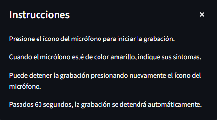
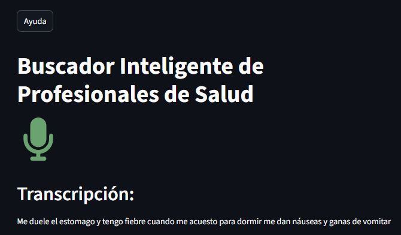

# 🏥 Buscador Inteligente de Profesionales de Salud

## 📋 Descripción del Proyecto

### El Problema
En Argentina, existe una gran fragmentación en el sistema de salud que dificulta a los ciudadanos encontrar la atención médica apropiada. Los pacientes a menudo no saben qué especialidad médica necesitan según sus síntomas, y la búsqueda de profesionales adecuados puede ser compleja y consume tiempo valioso, ya sea por recorridos presenciales visitando cada establecimiento, o una busqueda en internet. Estas últimas, pueden realizarse mediante buscadores básicos y populares como Google o mediante los sitios oficiales de instituciones de salud, lo cual obliga al usuario a tener que comprender sus interfaces antes de poder utilizarlos de manera fluída.

### La Solución Propuesta
Se desarrolló una aplicación web que utiliza **Inteligencia Artificial** para:
- **Capturar consultas médicas por voz** de forma natural e intuitiva
- **Transcribir automáticamente** el audio usando modelos de última generación
- **Buscar historias clínicas relacionadas** para identificar casos similares utilizando un modelo de lenguaje especializado en biomédicina
- **Extraer entidades médicas** (síntomas, condiciones, partes del cuerpo) del texto
- **Recomendar especialidades médicas** apropiadas basadas en el análisis con recuperación aumentada
- **Recopilar datos de contactos** de profesionales y establecimientos de salud públicos y privados

### Tecnologías Implementadas
- **Frontend**: Streamlit para interfaz web responsiva
- **Transcripción**: OpenAI Whisper API para conversión de voz a texto
- **Procesamiento NLP**: spaCy y Hugging Face Transformers
- **Modelos de ML**: Especializados en entidades biomédicas en español
- **RAG (Retrieval-Augmented Generation)**: LangChain con ChromaDB para búsqueda inteligente
- **Base de Datos Vectorial**: ChromaDB para almacenamiento y consulta de contactos
- **Infraestructura**: Docker para despliegue escalable

## 🎯 Características Principales

✅ **Interfaz Responsiva** - Acceso desde cualquier dispositivo  
✅ **Grabación de Audio Intuitiva** - Hasta 60 segundos de consulta por voz  
✅ **Transcripción Automática** - Transcripción de audio utilizando OpenAI Whisper  
✅ **Extracción de Entidades Médicas** - Detección inteligente de síntomas  
✅ **Recomendación de Especialidades** - Sugerencias basadas en IA 
✅ **Sistema RAG Avanzado** - Búsqueda inteligente con LangChain y ChromaDB   
✅ **Base de Datos Vectorial** - Búsqueda semántica de establecimientos de salud  

## 🚀 Inicio Rápido

### Instalación Local
```bash
# Clonar repositorio
git clone https://github.com/chinoavila/buscador_inteligente_salud
cd buscador_inteligente_salud

# Crear entorno virtual
python -m venv env
env\Scripts\activate  # Windows
source env/bin/activate  # Linux/Mac

# Instalar dependencias
pip install -r requirements.txt

# Configurar variables de entorno
cp .env.example .env
# Editar .env con tus API keys

# Ejecutar aplicación
streamlit run app.py
```

### Usando Docker (Recomendado)
```bash
# Clonar y configurar
git clone https://github.com/chinoavila/buscador_inteligente_salud
cd buscador_inteligente_salud
cp .env.example .env
# Editar .env con tus credenciales

# Ejecutar con Docker Compose
docker-compose up --build
```

La aplicación estará disponible en `http://localhost:8501`

## 📚 Documentación Completa

Para información detallada sobre instalación, configuración y uso, consulta nuestra documentación especializada:

- **[📖 Guía de Instalación Detallada](docs/instalacion-detallada.md)** - Instrucciones paso a paso para todos los entornos
- **[🎮 Guía de Uso Completa](docs/guia-de-uso.md)** - Cómo utilizar todas las funcionalidades
- **[⚙️ Documentación Técnica](docs/documentacion-tecnica.md)** - Arquitectura, APIs y desarrollo
- **[🚨 Solución de Problemas](docs/solucion-problemas.md)** - Resolución de errores comunes

## 🖼️ Capturas de Pantalla

### Interfaz Principal

*Interfaz minimalista y fácil de usar*

### Soporte In-App para Grabación de Audio

*Indicaciones acerca del uso del transcriptor de audio*

### Transcripción de Audio a Texto

*Transcripción automática con alta precisión*

### Recomendaciones de Especialidades

*Sugerencias de especialidades médicas*

## 🛠️ Tecnologías Utilizadas

**Frontend & Backend**
- Python 3.10+ - Lenguaje principal
- Streamlit 1.28+ - Framework web
- audio-recorder-streamlit - Módulo de Streamlit para captura de audio
- pandas - Procesamiento de datos

**Inteligencia Artificial**
- OpenAI Whisper - Transcripción de audio
- Hugging Face Transformers - Modelos biomédicos
- PyTorch 2.7+ - Framework de machine learning
- spaCy 3.8+ - Procesamiento de lenguaje natural
- LangChain 0.3+ - Framework para construcción de sistema RAG
- ChromaDB - Base de datos vectorial para RAG

**Infraestructura**
- Docker & Docker Compose - Contenedorización

## ⚠️ Importante - Uso Académico

>Este proyecto fue desarrollado con fines académicos como parte de la Maestría en Tecnologías de la Información (UNNE/UNaM) para la asignatura "Inteligencia Artificial". 
La aplicación no proporciona diagnósticos médicos, solo sugerencias orientativas de especialidades y todas las inferencias son obtenidas a través de los modelos de Hugging Face, spaCy/scispaCy y OpenAI. 
Por tal motivo, **no debe utilizarse como sustituto del consejo médico profesional**.
