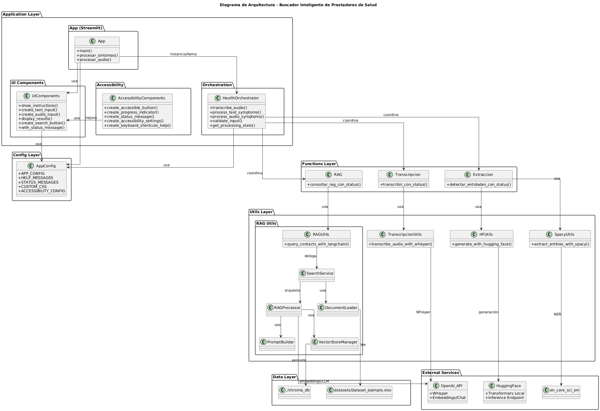
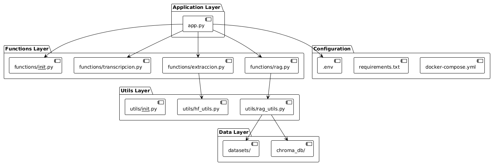
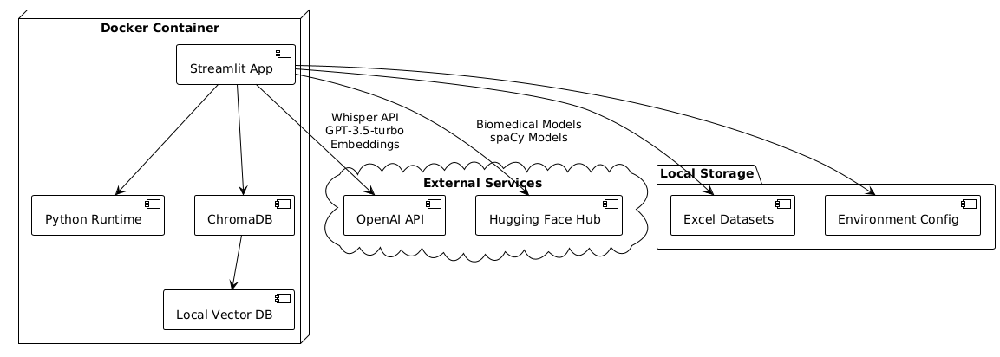
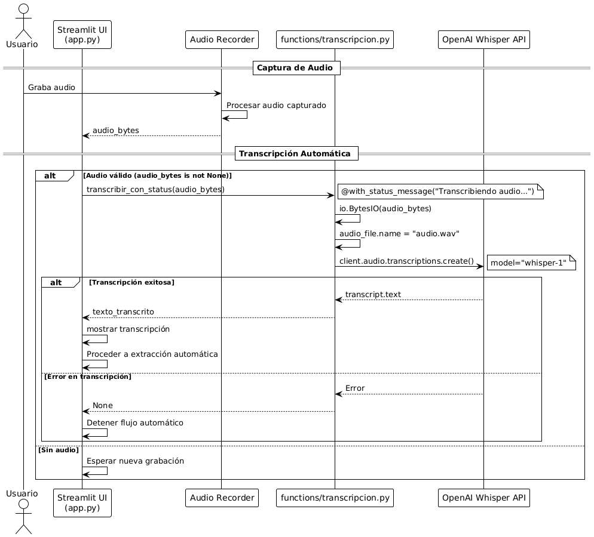
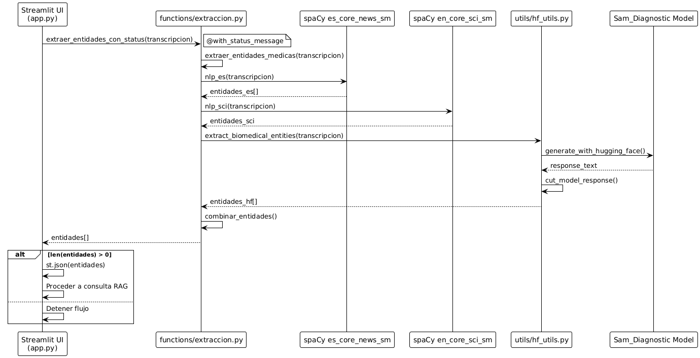
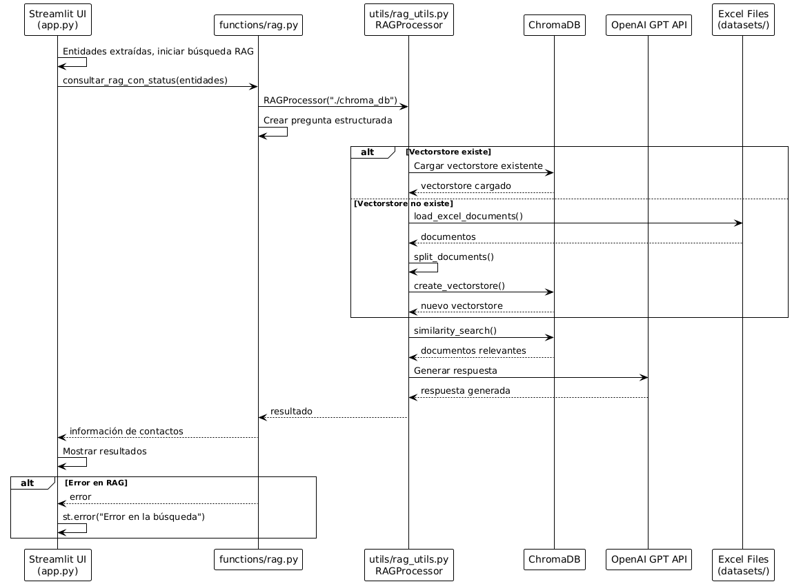

# Documentación Técnica

Esta documentación proporciona detalles técnicos sobre la arquitectura, componentes y funcionamiento interno del Buscador Inteligente de Profesionales de Salud.

## 🏗️ Arquitectura del Sistema

### Diagrama de Arquitectura


### Diagrama de Componentes



### Diagrama de Despliegue



### Componentes Principales

#### 1. Frontend (Streamlit)
- **Interfaz de usuario** web responsiva
- **Grabación de audio** mediante `audio-recorder-streamlit`
- **Visualización de resultados** de consulta
- **Manejo de estados** de la aplicación

#### 2. Backend (Python)
- **Procesamiento de audio** y datos
- **Integración con APIs** externas
- **Lógica de negocio** para busquedas
- **Gestión de datos** y archivos

#### 3. APIs Externas
- **OpenAI Whisper**: Transcripción de audio a texto
- **Hugging Face**: Modelos de procesamiento de lenguaje natural
- **spaCy**: Análisis morfológico y entidades nombradas

## 📂 Estructura de Código

### Directorio principal
```
buscador_inteligente_salud/
├── app.py                 # Punto de entrada de la app (Streamlit)
├── requirements.txt       # Dependencias Python
├── Dockerfile             # Imagen de la aplicación
├── docker-compose.yml     # Orquestación de servicios
└── README.md              # Documentación general
```

### Aplicación (presentación y orquestación)
```
application/
├── __init__.py
├── ui.py                  # Interfaz de aplicación (Streamlit)
├── orchestration.py       # Orquestación del flujo principal
├── accessibility.py       # Accesibilidad y ayudas visuales
└── config.py              # Configuración y manejo de entorno
```

### Módulos Funcionales
```
functions/
├── __init__.py              # Inicialización del módulo
├── transcripcion.py         # Transcripción con OpenAI Whisper
├── extraccion.py           # Extracción entidades médicas
└── rag.py                  # Lógica RAG con LangChain
```

### Utilidades
```
utils/
├── __init__.py              # Inicialización del módulo
├── hf_utils.py             # Integración Hugging Face
├── spacy_utils.py          # Procesamiento spaCy/scispaCy
├── rag_utils.py            # Utilidades RAG
└── whisper_utils.py        # Funciones auxiliares para Whisper
```

### Datos
```
datasets/
└── dataset_ejemplo.xlsx
```

### Persistencia (Vector DB)
```
chroma_db/
└── ...                     # Persistencia de embeddings en ChromaDB
```

### Documentación
```
docs/
├── documentacion-tecnica.md      # Documentación técnica detallada
├── guia-de-uso.md              # Guía de usuario
├── instalacion-detallada.md    # Instrucciones de instalación
├── solucion-problemas.md       # Resolución de problemas
├── images/
│   └── diagramas/              # Diagramas PNG usados en la doc
└── plantuml/                   # Diagramas fuente (.puml)
```

## 🔧 Componentes Técnicos Detallados

Esta sección describe los módulos del proyecto y sus contratos (entradas/salidas y errores esperados) basados en el código fuente.

### 1) UI y helpers (`application/ui.py`)

- Decorador de estado: `with_status_message(message: str)` muestra un mensaje temporal en la UI mientras se ejecuta la función decorada.
- Diálogo de ayuda: `show_instructions(max_segundos: int)` abre un modal con instrucciones de uso.
- Entrada de síntomas: `create_symptom_input_section()`, `create_styled_radio_input()`, `create_text_input()`, `create_audio_input()`.
- Resultados: `display_results(result_data: dict)` muestra transcripción y recomendaciones.
- Acción: `create_search_button(text_symptoms: Optional[str], disabled: bool=False)` valida y dispara la búsqueda.

Errores y estados: Usa componentes de Streamlit (info/success/error) y placeholders con `st.empty()`; no lanza excepciones, retorna/actualiza UI.

### 2) Orquestación (`application/orchestration.py`)

Clase principal: `HealthOrchestrator`
- `transcribe_audio(audio_bytes: bytes) -> Optional[str]`
- `process_text_symptoms(text_symptoms: str) -> dict`
- `process_audio_symptoms(audio_bytes: bytes, pretranscription: Optional[str]=None) -> dict`
- `validate_input(input_data: str, min_length: int|None=None) -> tuple[bool, Optional[str]]`

Contrato de `process_*` (salida):
- `success: bool`, `transcription|symptoms_text: str|None`, `entities: str|None`, `recommendations: str|None`, `error_message: str|None`.

Errores manejados: captura excepciones internas y devuelve `error_message` sin romper la UI.

### 3) Transcripción (`functions/transcripcion.py` + `utils/whisper_utils.py`)

Flujo:
- `transcribir_audio(bytes) -> str` llama a `utils.whisper_utils.transcribe_audio_with_whisper`.
- `transcribir_con_status(bytes) -> str` aplica el decorador `with_status_message("Transcribiendo audio...")`.

Implementación Whisper (OpenAI):
```python
from openai import OpenAI
client = OpenAI(api_key=os.getenv("OPENAI_API_KEY"))
client.audio.transcriptions.create(model="whisper-1", file=io.BytesIO(audio_bytes))
```

Entradas/salidas:
- Entrada: bytes de audio (WAV/MP3/MP4, etc.). Salida: texto.
Errores: propaga como `Exception("Error en transcripción con Whisper: ...")` y se capturan en capa superior.

### 4) Extracción de entidades (`functions/extraccion.py`, `utils/spacy_utils.py`, `utils/hf_utils.py`)

Pipeline híbrido:
1) Generación/normalización con HF: `generate_with_hugging_face(texto, "es", "en")`.
2) NER con SciSpaCy: `extract_entities_with_spacy(texto_en)` devuelve entidades separadas por coma o mensaje de “no detectado”.
3) Clasificación/formateo con HF: `generate_with_hugging_face(entidades, "en", "es")`.

Funciones expuestas:
- `detectar_entidades_medicas(texto: str) -> str`
- `detectar_entidades_con_status(transcripcion: str) -> str`

SciSpaCy (`utils/spacy_utils.py`): `load_model()` cacheado con `st.cache_resource`, modelo `en_core_sci_sm`; `extract_entities_with_spacy(input_text) -> str`.

Hugging Face (`utils/hf_utils.py`):
- Soporta modo remoto (Inference Endpoint) mediante `HF_ENDPOINT_URL` y `HF_TOKEN` y modo local (transformers) con `somosnlp/Sam_Diagnostic`.
- Recorte de salida con marcadores `<start_of_turn>`/`<end_of_turn>`.

Errores típicos: falta de modelo `en_core_sci_sm`, endpoint HF no configurado, tiempo de espera al generar.

### 5) Sistema RAG (`utils/rag_utils.py` + `functions/rag.py`)

Configuración (`Config`):
- Excel: `datasets/dataset_ejemplo.xlsx`
- Embeddings: `text-embedding-3-large`
- Vector DB: `./chroma_db` (Chroma + `PersistentClient`)
- LLM: `gpt-3.5-turbo` (ChatOpenAI), temperatura por defecto 0.3

Componentes:
- `DocumentLoader.load_excel_documents(path) -> list[Document]`
- `VectorStoreManager` crea/carga Chroma con OpenAIEmbeddings
- `PromptBuilder.get_search_prompt()` define formato de respuesta de prestadores
- `RAGProcessor` segmenta (`RecursiveCharacterTextSplitter`), configura retriever y `RetrievalQA`
- `SearchService.search(query) -> str` extrae `medical_specialty` del JSON, arma queries por especialidad, recopila documentos relevantes y responde usando RAG o LLM directo con contexto.
- `get_health_service()` patrón singleton
- `query_contacts_with_langchain(input_text) -> str`
- `functions/rag.py` expone `consultar_rag(text)` y `consultar_rag_con_status(entidades_medicas)` con decorador de estado.

Errores y bordes:
- Vectorstore inexistente: se crea si hay documentos; si no, devuelve “No se encontraron resultados”.
- Excel inaccesible: excepción al cargar; el orquestador traduce a `error_message`.
- Consulta sin especialidad: usa búsqueda general con términos amplios.

### 6) Configuración y variables de entorno relevantes

- `OPENAI_API_KEY`: requerido para Whisper y Embeddings/LLM de OpenAI.
- `HF_TOKEN`, `HF_ENDPOINT_URL`: opcionales para usar endpoint remoto de HF.
- Modelo SciSpaCy `en_core_sci_sm`: debe estar instalado en el entorno.

### 7) Contratos y casos límite resumidos

- Audio vacío/no válido: transcripción falla y retorna `error_message` de orquestación.
- Texto muy corto: `validate_input` fuerza mínimo (config) y advierte en UI.
- Sin entidades detectadas: mensaje sugerente para mejorar la descripción.
- RAG sin documentos relevantes: respuesta estándar “No se encontraron resultados…”.

## 🔄 Flujo de Datos

### Vista general del flujo


### Secuencia: Transcripción de Audio



### Secuencia: Extracción de Entidades



### Secuencia: Sistema RAG



## 📦 Dependencias y Tecnologías

### Dependencias principales (requirements)

#### Framework y UI
- streamlit>=1.28.0 — framework web para la interfaz de usuario
- audio-recorder-streamlit==0.0.10 — componente de grabación de audio

#### APIs y ML
- openai>=1.0.0 — cliente oficial para Whisper y modelos GPT/Embeddings
- transformers>=4.30.0,<4.40.0 — inferencia local (HF); usado en modo local de `hf_utils`
- huggingface_hub>=0.19.0 — cliente del Hub de Hugging Face (descargas/modelos)
- torch>=2.0.0,<2.5.0 — backend de inferencia para transformers (CPU/GPU)
- spacy>=3.7.0,< 3.8.0 — NLP general; base para SciSpaCy
- spacy-lookups-data==1.0.5 — tablas de lookup para spaCy

#### RAG y LangChain
- langchain==0.3.27 — orquestación de LLMs y chains
- langchain-openai>=0.1.0 — integración de OpenAI (Chat/Embeddings)
- langchain-community>=0.2.0 — loaders y utilidades de la comunidad
- langchain-chroma>=0.1.2 — integración con ChromaDB
- chromadb>=0.5.0,<0.6.0 — base de datos vectorial (PersistentClient)

#### Datos y utilidades
- pandas>=1.5.0,< 3.0.0 — manejo de datos tabulares (Excel)
- numpy>=1.24.0,<2.0.0 — cómputo numérico
- openpyxl>=3.1.0 — lectura de archivos .xlsx
- python-dotenv==1.0.0 — carga de variables de entorno
- requests>=2.31.0 — llamadas HTTP (HF Endpoints)

#### Modelo especializado (SciSpaCy)
- en_core_sci_sm (SciSpaCy v0.5.4) — modelo biomédico para NER basado en spaCy
  - Instalación desde URL en requirements: https://s3-us-west-2.amazonaws.com/ai2-s2-scispacy/releases/v0.5.4/en_core_sci_sm-0.5.4.tar.gz

### Stack tecnológico RAG

#### Vector database
- ChromaDB (>=0.5,<0.6) con persistencia en `./chroma_db`
- Embeddings por defecto: OpenAI `text-embedding-3-large` (vía `langchain-openai`)

#### Componentes LangChain
- Carga de documentos: desde Excel (pandas) → `Document`
- Particionado: `RecursiveCharacterTextSplitter` (chunk_size 1000, overlap 100)
- Retriever y QA: `RetrievalQA` con `ChatOpenAI` y prompt especializado

#### Modelos de lenguaje
- ChatOpenAI: `gpt-3.5-turbo` para generación contextualizada
- OpenAI Embeddings: `text-embedding-3-large` para vectorización
- NER biomédico auxiliar: `somosnlp/Sam_Diagnostic` (transformers) en modo local o vía endpoint HF

### Notas de compatibilidad y entorno
- Variables: requiere `OPENAI_API_KEY`; opcionales `HF_TOKEN` y `HF_ENDPOINT_URL` para endpoints remotos de HF.
- GPU (opcional): si hay CUDA disponible, `torch` y `transformers` pueden acelerar la inferencia local.

### Protección de datos sensibles
- API keys en `.env`, sin exponer en código ni logs.
- Audio en memoria; sin persistencia del archivo de entrada.
- Transcripciones y resultados manejados en sesión; evitar PII en logs.

## 🧩 Extensibilidad

### Nuevos Modelos
Para agregar modelos de ML:
1. Crear función en `utils/`
2. Registrar en pipeline principal
3. Documentar cambios

### Nuevas Funcionalidades
Estructura para extensiones:
```python
# utils/nueva_funcionalidad.py
def nueva_funcion():
    """Documentación de la nueva función"""
    pass

# Integración en app.py
from utils.nueva_funcionalidad import nueva_funcion
```

### APIs Adicionales
Para integrar nuevos servicios:
1. Agregar credenciales a `.env`
2. Crear módulo de integración
3. Manejar errores específicos
4. Actualizar documentación
