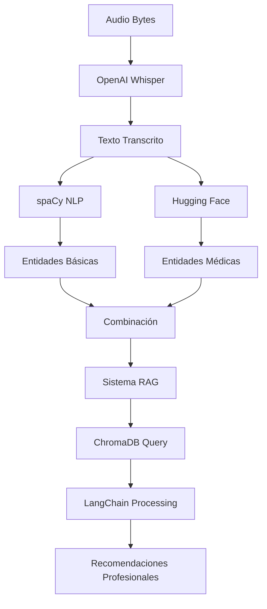
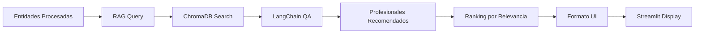

# Documentación Técnica

Esta documentación proporciona detalles técnicos sobre la arquitectura, componentes y funcionamiento interno del Buscador Inteligente de Profesionales de Salud.

## 🏗️ Arquitectura del Sistema

### Diagrama de Arquitectura
```
┌─────────────────┐    ┌─────────────────┐    ┌─────────────────┐
│   Frontend      │    │   Backend       │    │   APIs Externas │
│   (Streamlit)   │◄──►│   (Python)      │◄──►│   (OpenAI/HF)   │
└─────────────────┘    └─────────────────┘    └─────────────────┘
         │                       │                       │
         │                       │                       │
         ▼                       ▼                       ▼
┌─────────────────┐    ┌─────────────────┐    ┌─────────────────┐
│   Audio Input   │    │   Processing    │    │   ML Models     │
│   (Microphone)  │    │   Pipeline      │    │   (spaCy/HF)    │
└─────────────────┘    └─────────────────┘    └─────────────────┘
```

### Componentes Principales

#### 1. Frontend (Streamlit)
- **Interfaz de usuario** web responsiva
- **Grabación de audio** mediante `audio-recorder-streamlit`
- **Visualización de resultados** de consulta
- **Manejo de estados** de la aplicación

#### 2. Backend (Python)
- **Procesamiento de audio** y datos
- **Integración con APIs** externas
- **Lógica de negocio** para busquedas
- **Gestión de datos** y archivos

#### 3. APIs Externas
- **OpenAI Whisper**: Transcripción de audio a texto
- **Hugging Face**: Modelos de procesamiento de lenguaje natural
- **spaCy**: Análisis morfológico y entidades nombradas

## 📂 Estructura de Código

### Directorio Principal
```
buscador_inteligente_salud/
├── app.py                    # Aplicación principal Streamlit
├── requirements.txt          # Dependencias Python
├── Dockerfile               # Configuración Docker
├── docker-compose.yml       # Orquestación servicios
├── .env.example            # Template variables entorno
└── README.md               # Documentación principal
```

### Módulos Funcionales
```
functions/
├── __init__.py              # Inicialización del módulo
├── transcripcion.py         # Transcripción con OpenAI Whisper
├── extraccion.py           # Extracción entidades médicas
└── rag.py                  # Lógica RAG con LangChain
```

### Utilidades
```
utils/
├── __init__.py              # Inicialización del módulo
├── hf_utils.py             # Integración Hugging Face
├── spacy_utils.py          # Procesamiento spaCy
├── rag_utils.py            # Utilidades RAG
└── ui_utils.py             # Utilidades interfaz usuario
```

### Datos
```
datasets/
└── dataset_ejemplo.xlsx
```

### Documentación
```
docs/
├── documentacion-tecnica.md      # Documentación técnica detallada
├── guia-de-uso.md              # Guía de usuario
├── instalacion-detallada.md    # Instrucciones de instalación
├── solucion-problemas.md       # Resolución de problemas
├── README.md                   # Documentación general
└── images/                     # Recursos gráficos
```

## 🔧 Componentes Técnicos Detallados

### 1. Aplicación Principal (`app.py`)

#### Configuración de Streamlit
```python
st.set_page_config(
    page_title="Buscador Inteligente de Salud",
    page_icon="🏥",
    layout="wide",
    initial_sidebar_state="collapsed"
)
```

#### Funciones Importadas
```python
from functions import (
    transcribir_con_status,
    detectar_entidades_con_status,
    consultar_rag_con_status
)
```

#### Características Principales
- **Grabación de audio**: Limitada a 60 segundos máximo
- **Interfaz responsiva**: Layout wide para mejor visualización
- **Estados manejados**: Control de flujo de la aplicación
- **Integración HF Spaces**: Configuración automática para Hugging Face

### 2. Transcripción de Audio (`functions/transcripcion.py`)

#### Función Principal
```python
def transcribir_audio_whisper(audio_bytes: bytes) -> str:
    """
    Transcribe audio usando OpenAI Whisper API
    
    Args:
        audio_bytes: Datos de audio en formato bytes
    
    Returns:
        str: Texto transcrito
    """
```

#### Características Técnicas
- **Modelo**: `whisper-1` (OpenAI API)
- **Formato de entrada**: WAV, MP3, MP4, etc.
- **Idioma**: Detección automática (optimizado para español)
- **Tamaño máximo**: 25MB por archivo
- **Tiempo de respuesta**: 5-15 segundos típico
- **Función con estado**: `transcribir_con_status()` para UI feedback

### 3. Extracción de Entidades (`functions/extraccion.py`)

#### Función Principal
```python
def extraer_entidades_medicas(texto: str) -> Dict[str, List[str]]:
    """
    Extrae entidades médicas del texto transcrito
    
    Args:
        texto: Texto de la transcripción
    
    Returns:
        Dict: Entidades categorizadas
    """
```

#### Modelos Utilizados
- **spaCy/SciSpaCy**: `en_core_sci_sm` para entidades biomédicas
- **Hugging Face**: `utils/hf_utils.py`
- **Combinación**: Múltiples fuentes para mayor precisión
- **Función con estado**: `detectar_entidades_con_status()` para UI feedback

### 4. Integración Hugging Face (`utils/hf_utils.py`)

#### Configuración
```python
from transformers import pipeline, AutoTokenizer, AutoModel

# Inicialización de modelos
ner_pipeline = pipeline(
    "ner",
    model="somosnlp/Sam_Diagnostic",
    tokenizer="somosnlp/Sam_Diagnostic"
)

# Modelos probados:
# https://huggingface.co/medicalai/ClinicalBERT
# https://huggingface.co/emilyalsentzer/Bio_ClinicalBERT        
# https://huggingface.co/medalpaca/medalpaca-7b
# https://huggingface.co/qanastek/MedAlpaca-LLaMa2-7B
# https://huggingface.co/siddharthtumre/biobert-finetuned-ner   
# https://huggingface.co/somosnlp/Sam_Diagnostic
```

#### Funcionalidades
- **NER médico**: Reconocimiento de entidades biomédicas
- **Clasificación**: Categorización de síntomas
- **Análisis de sentimientos**: Urgencia y gravedad
- **Cache**: Almacenamiento temporal de resultados

### 5. Procesamiento spaCy (`utils/spacy_utils.py`)

#### Inicialización
```python
import spacy

# Cargar modelo científico para biomedicina
nlp_sci = spacy.load("en_core_sci_sm")

# Configurar pipeline personalizado
nlp.add_pipe("custom_medical_ner")
```

#### Componentes Personalizados
- **Matcher**: Patrones específicos médicos
- **Ruler**: Reglas de entidades personalizadas
- **Filtros**: Eliminación de entidades irrelevantes
- **Pipeline dual**: Español general + científico biomédico

### 6. Utilidades de Interfaz (`utils/ui_utils.py`)

#### Funciones de Estado
```python
def show_instructions(max_segundos: int) -> None:
    """Muestra instrucciones de uso de la aplicación"""
    
def display_audio_info(audio_bytes: bytes) -> None:
    """Muestra información del audio grabado"""
```

#### Características
- **Feedback visual**: Indicadores de progreso
- **Instrucciones interactivas**: Ayuda contextual
- **Validación de entrada**: Control de calidad de audio

### 7. Sistema RAG (`functions/rag.py` y `utils/rag_utils.py`)

#### Arquitectura RAG
El sistema implementa Retrieval-Augmented Generation (RAG) para búsqueda inteligente de profesionales de salud:

```python
def consultar_rag(text):
    """
    Realizar consulta al sistema RAG
    :param text: Texto/JSON con especialidades a buscar
    :return: Respuesta con lista de contactos
    """
    try:
        return query_contacts_with_langchain(text)  
    except Exception as e:
        return f"Error en consulta RAG: {str(e)}"

def consultar_rag_con_status(entidades_json: str):
    """
    Consulta RAG con feedback de estado para la interfaz
    :param entidades_json: JSON con entidades extraídas
    :return: Resultados formateados para UI
    """
```

#### Componentes LangChain

##### RAGProcessor Class
```python
class RAGProcessor:
    """ Clase para manejar el procesamiento RAG con ChromaDB """
    def __init__(self, persist_directory="./chroma_db", chunk_size=1000, chunk_overlap=100):
        self.persist_directory = persist_directory
        self.embeddings = None
        self.vectorstore = None
        self.retriever = None
        self.qa_chain = None
```

##### Funcionalidades Principales
- **Carga de documentos**: Procesamiento de archivos Excel con datos de establecimientos de salud
- **Embeddings**: Generación de vectores usando OpenAI Embeddings API
- **ChromaDB**: Almacenamiento vectorial persistente con búsqueda semántica
- **Retrieval**: Búsqueda de documentos relevantes basada en similitud vectorial
- **QA Chain**: Cadena de pregunta-respuesta usando ChatOpenAI con contexto enriquecido
- **Múltiples datasets**: Integración de diversos archivos de establecimientos de salud

#### Datasets Integrados
1. **ACLISA**: Instituciones y prestadores privados
2. **SISA**: Listado oficial de establecimientos
3. **REFES**: Centros públicos de atención primaria
4. **REFES**: Establecimientos de salud privados
5. **REFES**: Establecimientos de salud pública con internación

#### Pipeline de Procesamiento RAG
1. **Carga de datos**: Lectura de múltiples archivos Excel con información de establecimientos de salud argentinos
2. **Chunking**: División de texto en fragmentos manejables con solapamiento
3. **Embedding**: Conversión de texto a vectores usando OpenAI text-embedding-3-large
4. **Indexación**: Almacenamiento en ChromaDB para búsqueda vectorial rápida
5. **Retrieval**: Búsqueda de documentos relevantes basada en query del usuario
6. **Generation**: Generación de respuesta usando LLM con contexto enriquecido
7. **Post-procesamiento**: Formateo y estructuración de resultados para UI

#### Configuración ChromaDB
```python
# Configuración global
CHROMA_DB_PATH = "./chroma_db"

def create_vectorstore(self, documents):
    """ Crear vectorstore con ChromaDB """
    text_splitter = RecursiveCharacterTextSplitter(
        chunk_size=self.chunk_size,
        chunk_overlap=self.chunk_overlap
    )
    splits = text_splitter.split_documents(documents)
    
    self.vectorstore = Chroma.from_documents(
        documents=splits,
        embedding=self.embeddings,
        persist_directory=self.persist_directory
    )
```

#### Modelos Utilizados en RAG
- **OpenAI Embeddings**: `text-embedding-3-large` para vectorización
- **ChatOpenAI**: `gpt-3.5-turbo` para generación de respuestas
- **ChromaDB**: Base de datos vectorial para almacenamiento y búsqueda
- **RecursiveCharacterTextSplitter**: División inteligente de documentos

## 🔄 Flujo de Datos

### 1. Captura de Audio

```mermaid
graph LR
    A[Usuario] --> B[Micrófono]
    B --> C[Navegador]
    C --> D[audio-recorder-streamlit]
    D --> E[Bytes de Audio]
```

### 2. Procesamiento Principal

```mermaid
graph TD
    A[Audio Bytes] --> B[OpenAI Whisper]
    B --> C[Texto Transcrito]
    C --> D[spaCy NLP]
    C --> E[Hugging Face]
    D --> F[Entidades Básicas]
    E --> G[Entidades Médicas]
    F --> H[Combinación]
    G --> H
    H --> I[Sistema RAG]
    I --> J[ChromaDB Query]
    J --> K[LangChain Processing]
    K --> L[Recomendaciones Profesionales]
```

### 3. Presentación de Resultados

```mermaid
graph LR
    A[Entidades Procesadas] --> B[RAG Query]
    B --> C[ChromaDB Search]
    C --> D[LangChain QA]
    D --> E[Profesionales Recomendados]
    E --> F[Ranking por Relevancia]
    F --> G[Formato UI]
    G --> H[Streamlit Display]
```

## 📦 Dependencias y Tecnologías

### Dependencias Principales

#### Framework y UI
- `streamlit>=1.28.0` - Framework web para la interfaz de usuario
- `audio-recorder-streamlit==0.0.10` - Componente de grabación de audio

#### APIs y ML
- `openai>=1.0.0` - API de OpenAI para transcripción con Whisper
- `transformers>=4.30.0,<4.40.0` - Modelos de Hugging Face
- `huggingface-hub>=0.16.4,<0.30.0` - Cliente para Hub de Hugging Face
- `torch>=2.0.0,<2.5.0` - Framework de machine learning PyTorch
- `spacy>=3.7.0,<3.8.0` - Procesamiento de lenguaje natural

#### RAG y LangChain
- `langchain==0.3.27` - Framework para aplicaciones de IA con LLMs
- `langchain-openai>=0.1.0` - Integración específica de OpenAI con LangChain
- `langchain-community>=0.2.0` - Componentes comunitarios de LangChain
- `chromadb>=0.4.0` - Base de datos vectorial para embeddings

#### Datos y Utilidades
- `pandas>=1.5.0,<3.0.0` - Manipulación y análisis de datos estructurados
- `numpy>=1.24.0,<2.0.0` - Computación numérica y arrays
- `openpyxl>=3.1.0` - Lectura y escritura de archivos Excel
- `python-dotenv==1.0.0` - Gestión de variables de entorno
- `pydantic>=2.0.0` - Validación de datos y modelos
- `typing-extensions>=4.8.0` - Extensiones del sistema de tipos

#### Modelos Especializados
- `spacy-lookups-data==1.0.5` - Datos de lookup para spaCy
- `en_core_sci_sm` - Modelo científico de spaCy para biomedicina (scispacy)

### Stack Tecnológico RAG

#### Vector Database
- **ChromaDB**: Base de datos vectorial para almacenamiento y búsqueda semántica
- **Embeddings**: OpenAI text-embedding-3-large para vectorización de documentos
- **Persistencia**: Almacenamiento local en directorio `./chroma_db`

#### LangChain Components
- **Document Loaders**: Carga de archivos Excel con datos de establecimientos de salud
- **Text Splitters**: RecursiveCharacterTextSplitter para chunking inteligente de documentos
- **Vector Stores**: Integración completa con ChromaDB para indexación y búsqueda
- **Retrievers**: Búsqueda de documentos relevantes basada en similitud semántica
- **Chains**: RetrievalQA para preguntas y respuestas con contexto enriquecido
- **Embeddings**: Integración con OpenAI Embeddings API

#### Modelos de Lenguaje
- **ChatOpenAI**: gpt-3.5-turbo para generación de respuestas contextualizadas
- **OpenAI Embeddings**: text-embedding-3-large para vectorización de documentos
- **Configuración optimizada**: Temperature y max_tokens ajustados para consultas médicas
- **Modelo biomédico**: `somosnlp/Sam_Diagnostic` para NER médico

### Protección de Datos Sensibles
- **API Keys**: Almacenadas exclusivamente en variables de entorno (.env)
- **Audio grabado**: Procesamiento en memoria, sin almacenamiento persistente
- **Transcripciones**: Manejo temporal durante la sesión activa únicamente
- **Logs del sistema**: Configurados sin inclusión de información personal identificable
- **Datos de salud**: Cumplimiento con normativas de protección de datos médicos

## 🧩 Extensibilidad

### Nuevos Modelos
Para agregar modelos de ML:
1. Crear función en `utils/`
2. Registrar en pipeline principal
3. Documentar cambios

### Nuevas Funcionalidades
Estructura para extensiones:
```python
# utils/nueva_funcionalidad.py
def nueva_funcion():
    """Documentación de la nueva función"""
    pass

# Integración en app.py
from utils.nueva_funcionalidad import nueva_funcion
```

### APIs Adicionales
Para integrar nuevos servicios:
1. Agregar credenciales a `.env`
2. Crear módulo de integración
3. Manejar errores específicos
4. Actualizar documentación

## ⚙️ Configuración y Variables de Entorno

### Archivo .env.example
```bash
# Copia este archivo como .env y completa las variables

OPENAI_API_KEY=sk-your-openai-api-key-here
HF_TOKEN=hf_your-huggingface-token-here
STREAMLIT_PORT=your-streamlit-port
```

### Configuración para Hugging Face Spaces
```python
# Configuración de secrets en HF Spaces
# Añadir en Settings > Repository secrets:
# - OPENAI_API_KEY
# - HF_TOKEN
```

## 🚀 Guía de Instalación y Configuración

### Requisitos del Sistema
- **Python**: 3.8+ (recomendado 3.10)
- **Memoria RAM**: Mínimo 4GB, recomendado 8GB+
- **Espacio en disco**: Mínimo 5GB para modelos y cache
- **Sistema operativo**: Windows 10+, macOS 10.14+, Ubuntu 18.04+

### Instalación Local

#### 1. Clonación y Configuración
```bash
git clone https://github.com/usuario/buscador_inteligente_salud.git
cd buscador_inteligente_salud
```

#### 2. Entorno Virtual
```bash
python -m venv env
# Windows
env\Scripts\activate
# macOS/Linux  
source env/bin/activate
```

#### 3. Instalación de Dependencias
```bash
pip install -r requirements.txt
```

#### 4. Configuración de Variables
```bash
cp .env.example .env
# Editar .env con tus API keys
```

#### 5. Ejecución
```bash
streamlit run app.py
```

### Instalación con Docker

#### Docker Compose (Recomendado)
```bash
docker-compose up --build
```

#### Docker Manual
```bash
docker build -t buscador-salud .
docker run -p 8501:8501 --env-file .env buscador-salud
```
