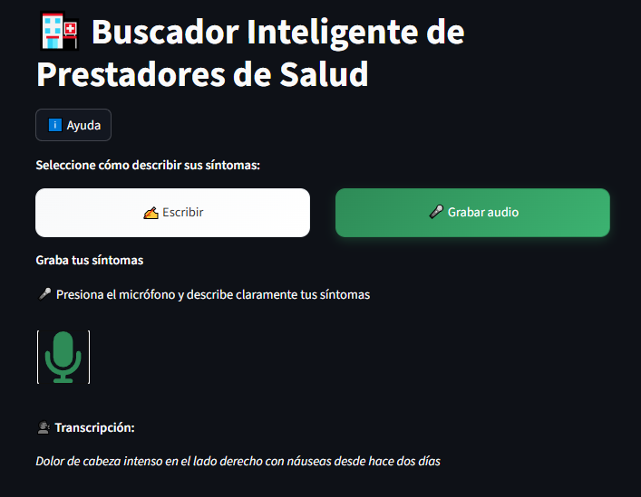

# Guía de Uso

Esta guía explica cómo utilizar el Buscador Inteligente de Prestadores de Salud para encontrar profesionales médicos apropiados.

## 🎯 Descripción General

Aplicación web que encuentra prestadores de salud apropiados basándose en la descripción de síntomas mediante:

1. **Entrada Dual**: Audio (60s máx.) o texto directo
2. **Análisis Automático**: Identificación de síntomas y condiciones médicas  
3. **Búsqueda Inteligente**: Recomendaciones personalizadas de prestadores

**🌐 Acceso:** `http://localhost:8501` (local) o Hugging Face Spaces (desplegado)

## 📱 Interfaz de Usuario


**Elementos principales:**
- **Selector de método**: Radio buttons para texto o audio
- **Botón de ayuda**: Instrucciones y consejos
- **Área de entrada**: Campo de texto o grabador según selección
- **Panel de resultados**: Muestra análisis y recomendaciones

## ❓ Ventana de Ayuda


La ventana de ayuda proporciona instrucciones detalladas y consejos para usar la aplicación de manera efectiva. Accesible desde el botón "❓ Ayuda" en la interfaz principal.

## 📝 Métodos de Entrada

### 💻 Entrada de Texto
**Ventajas**: Control total, edición en tiempo real, no requiere micrófono

**Pasos:**
1. Seleccionar "Ingresar texto directamente"
2. Escribir descripción detallada
3. Hacer clic en "Analizar síntomas"

### 🎙️ Grabación de Audio  
**Ventajas**: Natural, conversacional, ideal para dificultades de escritura



**Pasos:**
1. Seleccionar "Grabar audio"
2. Permitir acceso al micrófono
3. Hacer clic en botón de grabación
4. Hablar claramente (máx. 60s)
5. Hacer clic para detener
6. El audio se convierte automáticamente a texto

### 📋 Consejos para Mejores Resultados
- **Ser específico**: "dolor en sien derecha" vs "dolor de cabeza"
- **Incluir detalles**: intensidad (leve/severo), duración (3 días), características (punzante/sordo)
- **Mencionar síntomas relacionados**: náuseas, mareos, sensibilidad a luz
- **Audio**: ambiente silencioso, distancia 15-30cm, velocidad moderada

### Ejemplo de Consulta Óptima
```
"Tengo dolor de cabeza intenso desde hace tres días, 
localizado en la sien derecha, acompañado de náuseas 
y sensibilidad a la luz. El dolor empeora por las mañanas 
y mejora ligeramente con paracetamol."
```

## 🔍 Análisis y Resultados

### Información Detectada
El sistema identifica automáticamente:
- **Síntomas**: dolor, fiebre, mareos, náuseas
- **Ubicación**: cabeza, estómago, corazón, extremidades  
- **Condiciones**: diabetes, hipertensión, alergias
- **Medicamentos**: nombres de fármacos mencionados

## 🚀 Recomendaciones

### Información Relevante
- **Síntomas específicos**: ubicación, intensidad, duración
- **Contexto temporal**: cuándo comenzó, evolución, frecuencia
- **Síntomas acompañantes**: lo que se presenta junto al problema principal
- **Factores agravantes/aliviantes**: qué empeora o mejora los síntomas

### Información a Evitar
- **Datos personales**: nombres, apellidos, documentos de identidad
- **Información médica sensible**: historial detallado, diagnósticos previos específicos
- **Medicación actual**: solo mencionar si está directamente relacionada con el síntoma actual

## 🚨 Importantes

### Uso Académico
- Este proyecto es **solo para fines académicos**
- **No reemplaza** consulta médica profesional
- **No proporciona diagnósticos** médicos

### Limitaciones
- Las sugerencias son **orientativas únicamente**
- La precisión depende de la **calidad del audio**
- Los modelos pueden tener **sesgos o errores**

### Privacidad
- **No se almacenan** grabaciones de audio
- **No se guardan** transcripciones permanentemente
- **No se recopilan** datos personales del usuario
